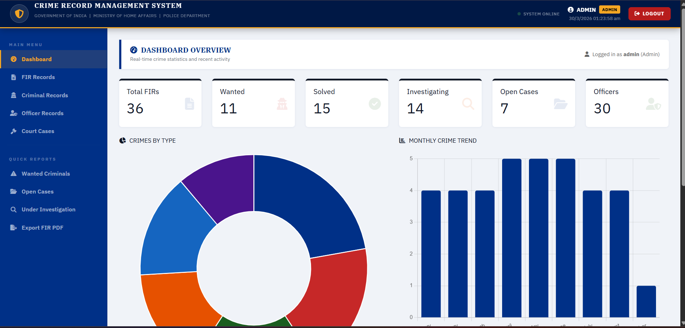
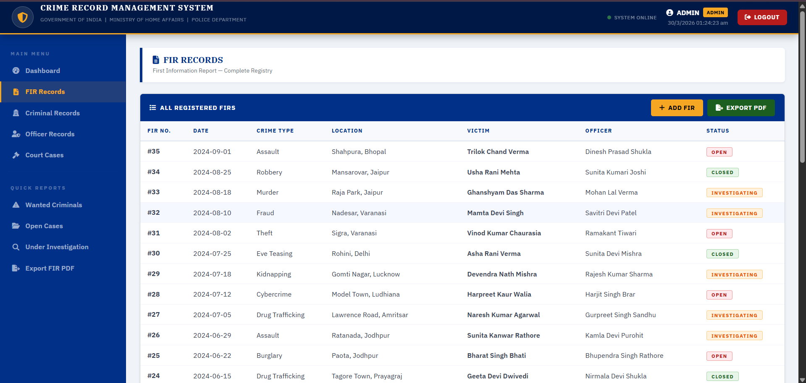
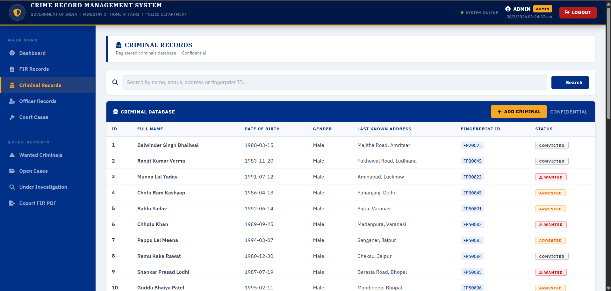
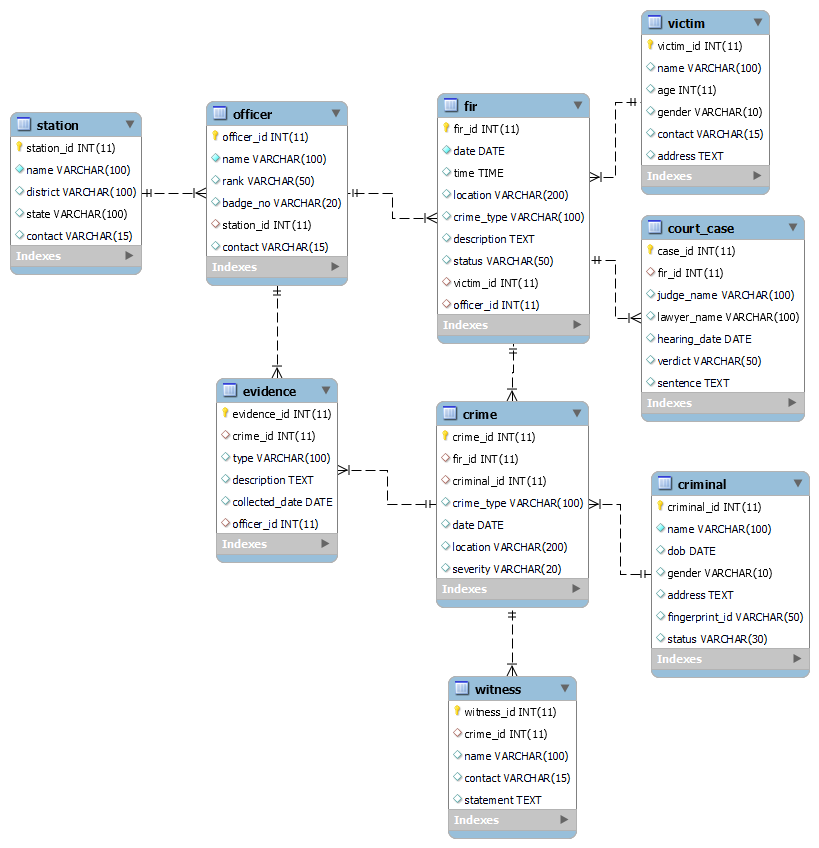

# 🚔 Crime Record Management System (CRMS)

A web-based Crime Record Management System built using **Python Flask** and **MySQL**, 
designed to simulate real-world police department operations.

---

## 🌐 Live Demo
🔗 [Coming Soon - Deploying on PythonAnywhere]

---

## 📌 Features
- 🔐 Role-based Login System (Admin / Officer)
- 📋 FIR Registration and Management
- 👤 Criminal Records Database with Search
- 👮 Officer and Station Management
- ⚖️ Court Case and Verdict Tracking
- 📊 Dashboard with Live Charts
- 📄 Export FIR Report to PDF
- 🔍 Advanced Search Functionality

---

## 🛠️ Tech Stack

| Layer | Technology |
|---|---|
| Backend | Python Flask |
| Database | MySQL (MariaDB) |
| Frontend | HTML5, CSS3, Bootstrap 5 |
| Charts | Chart.js |
| Icons | Font Awesome 6 |
| Server | XAMPP (Local) / PythonAnywhere (Live) |

---

## 🗃️ Database Schema

- **9 Tables** — Station, Officer, Victim, Criminal, FIR, Crime, Evidence, Witness, Court_Case
- **Normalized** up to 3NF
- **Triggers** — Auto update criminal status on verdict
- **Views** — Active cases, Wanted criminals, Officer performance
- **Stored Procedures** — Search criminal, Register FIR, Get case report

---

## ⚙️ Local Setup

### Prerequisites
- Python 3.x
- XAMPP (MySQL)
- pip

### Installation
```bash
# Clone the repository
git clone https://github.com/YOUR_USERNAME/Crime-Record-Management-System.git

# Go to project folder
cd Crime-Record-Management-System

# Install dependencies
pip install -r requirements.txt

# Start XAMPP MySQL
# Import database from crms.sql file

# Run the app
python app.py
```

### Login Credentials
| Role | Username | Password |
|---|---|---|
| Admin | admin | admin123 |
| Officer | gurpreet | officer123 |

---

## 📸 Screenshots

### Dashboard


### FIR Records


### Criminal Records


---

## 📊 ER Diagram


---

## 🧠 Key Concepts Demonstrated
- Database Normalization (1NF → 2NF → 3NF)
- SQL Joins, Triggers, Views, Stored Procedures
- Flask routing and Jinja2 templating
- Session-based authentication
- MVC architecture pattern

---

## 👨‍💻 Developer
**Your Name**  
B.Tech CSE | [Your College Name]  
📧 your.email@gmail.com

---

## 📄 License
This project is for educational purposes only.